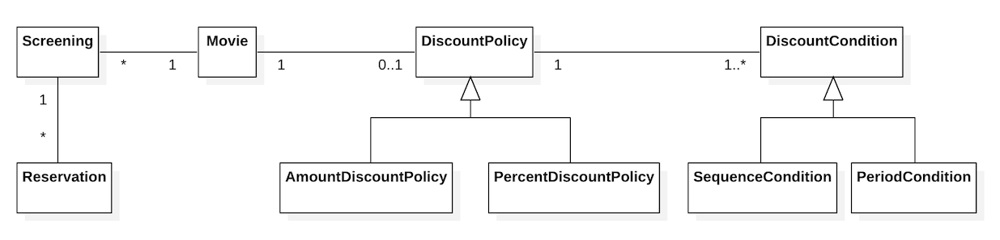
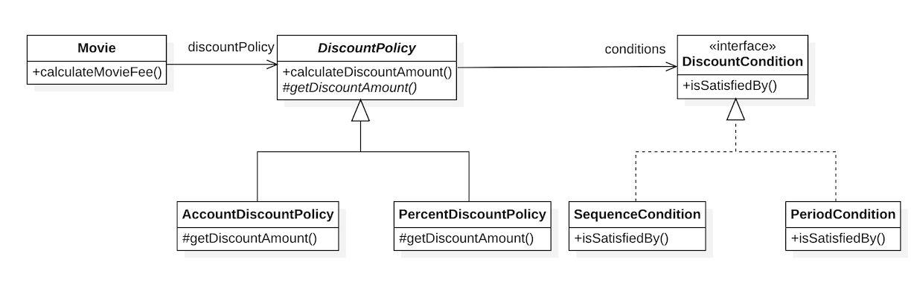

# 2\. 객체지향 프로그래밍

## 객체지향 프로그래밍을 향해

### 협력, 객체, 클래스

객체지향은 말 그대로 객체를 지향하는 것이다. 진정한 객체지향 패러다임으로의 전환은 클래스가 아닌 객체에 초점을 맞출 때에 얻을 수 있다. 이를 위해서 프로그래밍하는 동안 다음의 두 가지에 집중해야 한다.

1. 어떤 클래스가 필요한지를 고민하기 전에 **어떤 객체**들이 필요한지 고민하라. 클래스는 공통적인 상태와 행동을 공유하는 객체들을 추상화한 것이다.
2. 객체를 독립적인 존재가 아니라 기능을 구현하기 위해 협력하는 **공동체의 일원**으로 봐야 한다. 객체를 협력하는 공동체의 일원으로 바라보는 것은 설계를 유연하고 확장 가능하게 만든다.

### 도메인의 구조를 따르는 프로그램 구조

**도메인(domain)** 은 문제를 해결하기 위해 사용자가 프로그램을 사용하는 분야를 말한다. 일반적으로 클래스의 이름은 대응되는 도메인 개념의 이름과 동일하거나 적어도 유사하게 지어야 한다.

<i>**그림 2.1** 도메인 개념의 구조를 따르는 클래스 구조</i>

### 클래스 구현하기

클래스를 구현하거나 다른 개발자에 의해 개발된 클래스를 사용할 때 가장 중요한 것은 **클래스의 경계를 구분 짓는 것**이다.
클래스의 내부와 외부를 구분해야 하는 이유는 무엇일까? 그 이유는 **경계의 명확성이 객체의 자율성을 보장**하기 때문이다. 더 중요한 이유로 **프로그래머에게 규현의 자유를 제공**하기 때문이다.

#### 자율적인 객체

객체는 **상태(state)** 와 **행동(behavior)** 을 함께 가지는 복합 존재라는 것과 객체가 스스로 판다하고 행동하는 **자율적인 존재**라는 것을 알아야한다.

객체지향은 객체라는 단위 안에 데이터와 기능을 한 덩어리로 묶음으로써 문제 영역의 아이디어를 적절하게 표한할 수 있게 했다. 이처럼 데이터와 기능을 객체 내부로 함께 묶는 것을 **캡슐화**라고 부른다. 대부분의 객체지향 프로그래밍 언어들은 상태와 행동을 캡슐화하는 것에서 한 걸음 더 나아가 외부에서의 접근을 통제할 수 있는 **접근 제어(access control)** 매커니즘도 함께 제공한다.

객체 내부에 대한 접근을 통제하는 이유는 객체를 자율적인 존재로 만들기 위해서다. 객체지향의 핵심은 **스스로 상태를 관리하고, 판단하고, 행동하는 자율적인 객체들의 공동체**를 구성하는 것이다. 이처럼 자율적인 존재가 되기 위해서는 외부의 간섭을 최소화해야 한다.

캡슐화와 접근 제어는 객체를 두 부분으로 나눈다. 하나는 외부에서 접근 가능한 부분으로 **퍼블릭 인터페이스(public interface)** 라고 부른다. 다른 하나는 외부에서 접근 불가능하고 오직 내부에서만 접근 가능한 부분으로 이를 **구현(implementation)** 이라고 부른다. 이런 **인터페이스와 구현의 분리(separation of interface and implementation)** 원칙은 훌륭한 객체지향 프로그램을 만들기 위해 따라야 하는 핵심 원칙이다.

#### 프로그래머의 자유

프로그래머의 역할을 **클래스 작성자(class creator)** 와 **클라이언트 프로그래머(client programmer)** 로 구분하는 것이 유용하다. 클래스 작성자는 새로운 데이터 타입을 프로그램에 추가하고, 클라이언트 프로그래머는 클래스 작성자가 추가한 데이터 타입을 사용한다.

**클라이언트 프로그래머**의 목표는 애플리케이션을 빠르고 안정적으로 구축하는 것이다. **클래스 작성자**는 클라이언트 프로그래머에게 필요한 부분만 공개하고 나머지는 꽁꽁 숨겨야한다. 이렇게 함으로써 클라이언트 프로그래머에 대한 영향을 걱정하지 않고도 내부 구현을 마음대로 변경할 수 있다. 이를 **구현 은닉(implementation hiding)** 이라고 부른다.

접근 제어 매커니즘은 프로그래밍 언어 차원에서 클래스의 내부와 외부를 명확하게 경계 지을 수 있게하는 동시에 클래스 작성자가 내부 구현을 은닉할 수 있게 해준다. **구현 은닉**은 클래스 작성자와 프로그래머 모두에게 유용한 개념이다. **클라이언트 프로그래머**는 내부의 구현은 무시한 채 인터페이스만 알고 있어도 클래스를 사용할 수 있기 때문에 머릿속에 담아둬야 하는 지식의 양을 줄일 수 있다. **클래스 작성자**는 인터페이스를 바꾸지 않는 한 외부에 미치는 영향을 걱정하지 않고도 내부 구현을 마음대로 변경할 수 있다.

설계가 필요한 이유는 변경을 관리하기 위해서라는 것을 기억하라. 변경될 가능성이 있는 세부적인 구현 내용을 private 영역 안에 감춤으로써 변경으로 인한 혼란을 최소화할 수 있다.

### 협력하는 객체들의 공동체

객체지향의 장점은 객체를 이용해 도메인의 의미를 풍부하게 표현할 수 있다는 것이다. 개념을 명시적으로 표현하는 것은 전체적인 설계의 명확성과 유연성을 높이는 첫걸음이다.
시스템의 어떤 기능을 구현하기 위해 객체들 사이에 이뤄지는 상호작용을 **협력(Collaboration)** 이라고 부른다. 객체지향 프로그램을 작성할 때는 먼저 협력의 관점에서 어떤 객체가 필요한지를 결정하고, 객체들의 공통 상태와 행위를 구현하기 위해 클래스를 작성한다.

### 협력에 관한 짧은 이야기

객체는 다른 객체의 인터페이스에 공개된 행동을 수행하도록 **요청(request)** 할 수 있다. 요청을 받은 객체는 자율적인 방법에 따라 요청을 처리한 후 **응답(response)** 한다.

객체가 다른 객체와 상호작용할 수 있는 유일한 방법은 **메시지를 전송(send a message)** 하는 것뿐이다. 다른 객체에게 요청이 도착할 때 해당 객체가 **메시지를 수신(receive a message)** 했다고 이야기한다. 수신된 메시지를 처리하기 위한 자신만의 방법을 **메서드(method)** 라고 부른다.

## 할인 요금 구하기

### 할인 정책과 할인 조건

할인 정책은 금액 할인 정책과 비율 할인 정책으로 구분된다. 두 가지 할인 정책을 부모 클래스인 DiscountPolicy을 상속하는 AmountDiscountPolicy와 PercentDiscountPolicy라는 클래스로 구현할 것이다. 실제 애플리케이션에서는 DiscountPolicy의 인스턴스를 생성할 필요가 없기 때문에 **추상 클래스(abstract class)** 로 구현했다.

부모 클래스에 기본적인 알고리즘의 흐름을 구현하고 중간에 필요한 처리를 자식 클래스에게 위임하는 디자인 패턴을 **TEMPLATE METHOD 패턴**이라고 부른다.

<i>**그림 2.2** 할인 정책과 할인 조건</i>

> `오버라이딩`은 부모 클래스에 정의된 같은 이름, 같은 파라미터 목록을 가진 메서드를 자식클래스에서 재정의하는 경우를 가리킨다. `오버로딩`은 메서드의 이름은 같지만 제공되는 파라미터의 목록이 다르다.

## 상속과 다형성

### 컴파일 시간 의존성과 실행 시간 의존성

어떤 클래스가 다른 클래스에 접근할 수 있는 경로를 가지거나 해당 클래스의 객체의 메소드를 호출할 경우 두 클래스 사이에 의존성이 존재한다고 말한다.

코드의 의존성과 실행 시점의 의존성이 서로 다를 수 있다. 다시 말해 클래스 사이의 의존성과 객체 사이의 의존성은 동일하지 않을 수 있다. 유연하고, 쉽게 재사용할 수 있으며, 확장 가능한 객체지향 설계가 가지는 특징은 코드의 의존성과 실행 시점의 의존성이 다르다는 것이다.

코드의 의존성과 실행 시점의 의존성이 다르면 다를수록 코드를 이해하기 어려워지는 반면, 코드는 더 유연해지고 확장 가능해진다. 의존성의 양면성은 설계가 트레이드오프의 산물이라는 사실을 잘 보여준다.

### 차이에 의한 프로그래밍

클래스를 하나 추가하고 싶은데 그 클래스가 기존의 어떤 클래스와 매우 흡사하다고 가정해보자. 가장 좋은 방법은 클래스의 코드를 전혀 수정하지 않고도 재사용하는 것이다. 이를 가능하게 해주는 방법이 바로 **상속**이다. 상속은 객체지향에서 코드를 재사용하기 위해 가장 널리 사용되는 방법이다. 이처럼 부모 클래스와 다른 부분만을 추가해서 새로운 클래스를 쉽고 빠르게 만드는 방법을 **차이에 의한 프로그래밍(programming by difference)** 이라고 부른다.

### 상속과 인터페이스

**인터페이스**는 객체가 이해할 수 있는 목록을 정의한다. 객체 입장에서는 자신과 협력하는 객체가 어떤 클래스의 인스턴스인지가 중요한 것이 아니라 **메시지를 수신할 수 있다는 사실**이 중요하다. 협력 객체가 메시지를 이해할 수만 있다면 그 객체가 어떤 클래스의 인스턴스인지는 상관하지 않는다.

정리하면 자식 클래스는 상속을 통해 부모 클래스의 인터페이스를 물려받기 때문에 부모 클래스 대신 사용될 수 있다. 이처럼 자식 클래스가 부모 클래스를 대신하는 것을 **업캐스팅(upcasting)** 이라고 부른다.

### 다형성

코드 상에서 한 클래스가 다른 클래스에게 메시지를 전송하지만 실행 시점에 실제로 실행되는 메서드는 협력하는 객체의 **실제 클래스**가 무엇인지에 따라 달라진다. 동일한 메시지를 전송하지만 실제로 어떤 메서드가 실행될 것인지는 메시지를 수신하는 객체의 클래스가 무엇이냐에 따라 달라진다. 이를 **다형성**이라고 부른다.

**다형성**은 컴파일 시간 의존성과 실행 시간 의존성을 다르게 만들 수 있는 객체지향의 특성을 이용해 서로 다른 메서드를 실행할 수 있게 한다. 다형성이란 동일한 메시지를 수신했을 때 객체의 타입에 따라 다르게 응답할 수 있는 능력을 의미한다.

다형성을 구현하는 방법은 매우 다양하지만 메시지에 응답하기 위해 실행될 메서드를 컴파일 시점이 아닌 실행 시점에 결정한다는 공통점이 있다. 다시 말해 메시지와 메서드를 **실행 시점에 바인딩**한다. 이를 **지연 바인딩(lazy binding)** 또는 **동적 바인딩(dynamic binding)** 이라고 부른다.
이에 반해 전통적인 함수 호출처럼 **컴파일 시점**에 실행될 함수나 프로시저를 결정하는 것을 **초기 바인딩(early binding)** 또는 **정적 바인딩(static binding)** 이라고 부른다.

## 추상화와 유연성

### 추상화의 힘

추상화의 장점은 추상화의 계층만 따로 떼어 놓고 살펴보면 요구사항의 정책을 높은 수준에서 서술할 수 있고, 설계가 좀 더 유연해진다는 것이다. 추상화를 이용해 상위 정책을 기술한다는 것은 기본적인 애플리케이션의 **협력 흐름**을 기술한다는 것을 의미한다.

### 유연한 설계

책임의 위치를 결정하기 위해 조건문을 사용하는 것은 협력의 설계 측면에서 대부분의 경우 좋지 않은 선택이다. **추상화**를 중심으로 코드의 구조를 설계하면 유연하고 확장 가능한 설계를 만들 수 있다.

> 결론은 간단하다 유연성이 필요한 곳에 추상화를 사용하라

### 코드 재사용

코드 재사용을 위해서는 상속보다는 **합성(composition)** 이 더 좋은 방법이라는 이야기를 많이 들었을 것이다. **합성**은 다른 객체의 인스턴스를 자신의 인스턴스 변수로 포함해서 재사용하는 방법을 말한다.

### 상속

**상속**은 객체지향에서 코드를 재사용하기 위해 널리 사용되는 기법이다. 하지만 두 가지 관점에서 설계에 안 좋은 영향을 미친다. 하나는 상속이 **캡슐화를 위반한다**는 것이고, 다른 하나는 **설계를 유연하지 못하게 만든다**는 것이다.

상속을 이용하기 위해서는 부모 클래스의 내부 구조를 잘 알고 있어야 한다. 결과적으로 부모 클래스의 구현이 자식 클래스에게 노출되기 때문에 캡슐화가 약화된다. 또한, 상속은 부모 클래스와 자식 클래스의 관계를 컴파일 시점에 결정한다. 따라서 실행 시점에 객체의 종류를 변경하는 것이 불가능하다.

### 합성

인터페이스에 정의된 메시지를 통해서만 코드를 재사용하는 방법을 **합성**이라고 부른다. 합성은 인터페이스에 정의된 메시지를 통해서만 재사용이 가능하기 때문에 **구현을 효과적으로 캡슐화**할 수 있다. 의존하는 인스턴스를 교체하는 것이 비교적 쉽기 때문에 설계를 유연하게 만든다. 따라서 코드 재사용을 위해서는 상속보다는 합성을 선호하는 것이 좋은 방법이다.

객체지향에서 가장 중요한 것은 애플리케이션의 기능을 구현하기 위해 협력에 참여하는 객체들 사이의 상호작용이다. 객체들은 협력에 참여하기 위해 역할을 부여받고 역할에 적합한 책임을 수행한다.