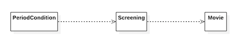
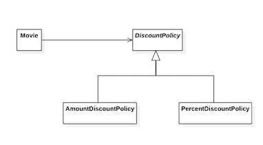
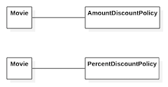

# 8\. 의존성 관리하기

잘 설계된 객체지향 애플리케이션은 **작고 응집도 높은 객체**들로 구성된다. 작고 응집도 높은 객체란 책임의 초점이 명확하고 한 가지 일만 잘 하는 객체를 의미한다. 일반적인 애플리케이션의 기능을 구현하기 위해서는 다른 객체에게 도움을 요청해야 한다. 이런 요청이 객체 사이의 **협력**을 낳는다.

협력은 객체가 다른 객체에 대해 알 것을 강요한다. 이런 지식이 객체 사이의 의존성을 낳는다.

협력을 위해서는 의존성이 필요하지만 과도한 의존성은 애플리케이션을 수정하기 어렵게 만든다. 객체지향 설계의 핵심은 협력을 위해 **필요한 의존성은 유지**하면서도 **변경을 방해하는 의존성은 제거**하는데 있다. 이런 관점에서 객체지향 설계란 **의존성을 관리**하는 것이고 객체가 변화를 받아들일 수 있게 **의존성을 정리**하는 기술이라고 할 수 있다.


## 의존성 이해하기

### 변경과 의존성

의존성은 실행 시점과 구현 시점에 서로 다른 의미를 가진다.

* **실행 시점** : 의존하는 객체가 정상적으로 동작하기 위해서는 실행 시에 의존 대상 객체가 반드시 존재해야 한다.
* **구현 시점** : 의존 대상 객체가 변경될 경우 의존하는 객체도 함께 변경된다.

어떤 객체가 예정된 작업을 정상적으로 수행하기 위해 다른 객체를 필요로 하는 경우 두 객체 사이에 **의존성이 존재**한다고 말한다. 두 요소 사이의 의존성은 의존되는 요소가 변경될 때 의존하는 요소도 함께 변경될 수 있다. 따라서 의존성은 **변경에 의한 영향의 전파 가능성**을 암시한다.


### 의존성 전이

**의존성 전이(transitive dependency)** 가 의미하는 것은 PeriodCondition이 Screening에 의존할 경우 PeriodCondition은 Screening이 의존하는 대상에 대해서도 자동적으로 의존하게 된다는 것이다.

<i><b>그림 8.1</b> 의존성 전이에 의해 잠재적으로 PeriodCondition은 Movie에 의존한다</i>

의존성은 함께 변경될 수 있는 <i>가능성</i>을 의미하기 때문에 모든 경우에 의존성이 전이되는 것은 아니다. 의존성 전이는 변경에 의해 영향이 널리 전파될 수도 있다는 경고일 뿐이다.

의존성은 전이될 수 있기 때문에 의존성의 종류를 **직접 의존성(direct dependency)** 과 **간접 의존성(indirect dependency)** 으로 나누기도 한다. **직접 의존성**이란 말 그대로 한 요소가 다른 요소에 직접 의존하는 경우를 가리킨다. **간접 의존성**이란 직접적인 관계는 존재하지 않지만 의존성 전이에 의해 영향이 전파되는 경우를 가리킨다.

변경과 관련이 있는 어떤 것에도 의존성이라는 개념을 적용할 수 있다. 의존성의 대상은 객체일 수도 있고 모듈이나 더 큰 규모의 실행 시스템일 수도 있다. 하지만 의존성의 본질은 변하지 않는다. **의존성이란** 의존하고 있는 대상의 변경에 영향을 받을 수 있는 가능성이다.


### 런타임 의존성과 컴파일타임 의존성

의존성과 관련해서 다뤄야 하는 또 다른 주제는 **런타임 의존성(run-time dependency)** 과 **컴파일타임 의존성(compile-time dependency)** 의 차이다. **런타임**은 말 그대로 애플리케이션이 실행되는 시점을 가리킨다. 일반적으로 **컴파일타임**이란 작성된 코드를 컴파일하는 시점을 가리키지만 문맥에 따라서는 코드 그 자체를 가리키기도 한다.

컴파일타임 의존성이라는 용어가 중요하게 생각하는 것은 시간이 아니라 우리가 작성한 **코드의 구조**이기 때문이다.

객체지향 애플리케이션에서 **런타임의 주인공**은 객체다. **런타임 의존성**이 다루는 주제는 객체 사이의 의존성이다. 반면 **코드 관점에서 주인공**은 클래스다. 따라서 **컴파일타임 의존성**이 다루는 주제는 클래스 사이의 의존성이다.


<i><b>그림 8.2</b> 코드 작성 시점의 Movie와 DiscountPolicy 사이의 의존성</i>

Movie는 가격을 계산하기 위해 비율 할인 정책과 금액 할인 정책 모두를 적용할 수 있게 설계해야 한다. 따라서 추상클래스인 DiscountPolicy에 의존하도록 설계했다.

하지만 런타임 의존성을 살펴보면 상황이 완전히 달라진다.

<i><b>그림 8.3</b> Movie의 인스턴스가 가지는 런타임 의존성</i>

Movie의 인스턴스가 이 두 클래스의 인스턴스와 함께 협력할 수 있게 만드는 더 나은 방법은 Movie가 두 클래스 중 어떤 것도 알지 못하게 만드는 것이다. 두 클래스 모두를 포괄하는 DiscountPolicy라는 추상 클래스에 의존하도록 만들고, **컴파일타임 의존성**을 실행시에 **런타임 의존성**으로 대체해야 한다.

어떤 클래스의 인스턴스가 다양한 클래스의 인스턴스와 협력하기 위해서는 협력할 인스턴스의 구체적인 클래스를 알아서는 안 된다. 실제로 협력할 객체가 어떤 것인지는 **런타임에 해결**해야 한다. 따라서 컴파일타임 구조와 런타임 구조 사이의 거리가 멀면 멀수록 설계까 유연해지고 재사용 가능해진다.


### 컨텍스트 독립성

클래스는 자신과 협력할 객체의 구체적인 클래스에 대해 알아서는 안 된다. 구체적인 클래스를 알면 알수록 그 클래스가 사용되는 **특정한 문맥에 강하게 결합**되기 때문이다.

구체적인 문맥은 컴파일타임 의존성을 어떤 런타임 의존성으로 대체하느냐에 따라 달라질 것이다. 클래스가 사용될 특정한 문맥에 대해 최소한의 가정만으로 이뤄져 있다면 다른 문맥에서 재사용하기가 더 수월해진다. 이를 **컨텍스트 독립성**이라고 부른다.

설계가 유연해지기 위해서는 자신이 실행될 컨텍스트에 대한 구체적인 정보를 **최대한 적게** 알아야 한다. 컨텍스트에 대한 정보가 적으면 적을수록 더 다양한 컨텍스트에서 재사용될 수 있기 때문이다.


### 의존성 해결하기

컴파일타임 의존성은 **구체적인 런타임 의존성**으로 대체돼야 한다. 컴파일타임 의존성을 실행 컨텍스트에 맞는 적절한 런타임 의존성으로 교체하는 것을 **의존성 해결**이라고 부른다. 의존성을 해결하기 위해서 일반적으로 다음과 같은 세 가지 방법을 사용한다.

* 객체를 생성하는 시점에 생성자를 통해 의존성 해결
* 객체 생성 후 setter 메소드를 통해 의존성 해결
* 메서드 실행 시 인자를 이용해 의존성 해결

<br>
**setter 메서드**를 이용하는 방식은 객체를 생성한 이후에도 의존하고 있는 대상을 변경할 수 있는 가능성을 열어 놓고 싶은 경우에 유용하다.

``` java
Movie avatar = new Movie(...);
avatar.setDiscountPolicy(new AmountDiscountPolicy(...));
...
avatar.setDiscountPolicy(new PercentDiscountPolicy(...));
```

setter 메서드를 이용하는 방법은 **실행 시점에 의존 대상을 변경**할 수 있기 때문에 설계를 좀 더 유연하게 만들 수 있다. 단점은 객체가 생성된 후에 협력에 필요한 의존 대상을 설정하기 때문에 객체를 생성하고 의존 대상을 설정하기 전까지 **객체의 상태가 불완전**할 수 있다는 점이다.

``` java
Movie avatar = new Movie(...);
avatar.calculateFee(...);       // 예외 발생
avatar.setDiscountPolicy(new AmountDiscountPolicy(...));
```

더 좋은 방법은 **생성자 방식과 setter 방식을 혼합**하는 것이다. 이 방법은 시스템의 상태를 안정적으로 유지하면서도 유연성을 향상시킬 수 있기 때문에 의존성 해결을 위해 가장 선호되는 방법이다.

``` java
Movie avatar = new Movie(..., new PercentDiscountPolicy(...));
...
avatar.setDiscountPolicy(new AmountDiscountPolicy(...));
```

Movie가 항상 할인 정책을 알 필요까지는 없고 가격을 계산할 때만 일시적으로 알아도 무방하다면 메서드의 인자를 이용해 의존성을 해결할 수도 있다.

``` java
public class Movie {
    public Money calculateMovieFee(Screening screening, DiscountPolicy discountPolicy) {
        return fee.minus(discountPolicy.calculateDiscountAmount(screening));
    }
}
```

**메서드 인자**를 사용하는 방식은 협력 대상에 대해 지속적으로 의존 관계를 맺을 필요 없을 경우 사용한다.


## 유연한 설계

### 의존성과 결합도

Movie가 비율 할인 정책을 구현하는 PercentDiscountPolicy에 직접 의존한다고 가정해보자.

``` java
public class Movie {
    private PercentDiscountPolicy percentDiscountPolicy;
    ...
}
```

문제는 의존성의 존재가 아니라 **의존성의 정도**다. 이 코드에서 Movie는 구체적인 클래스에 의존하기 때문에 다른 종류의 할인 정책이 필요한 문맥에서 Movie를 재사용할 수 있는 가능성을 없애 버렸다.

해결 방법은 **의존성을 바람직하게** 만드는 것이다. Movie의 입장에서는 협력할 객체의 클래스를 고정할 필요가 없다. 자신이 전송하는 메시지를 이해할 수 있다면 어떤 타입의 객체와 협력하더라도 상관이 없다.

바람직한 의존성은 **재사용성**과 관련이 있다. 어떤 의존성이 다양한 환경에서 재사용할 수 있다면 그 의존성은 바람직한 것이다. 다시 말해 **컨텍스트에 독립적**인 의존성은 **바람직한 의존성**이고 특정 **컨텍스트에 강하게 결합**된 의존성은 **바람직하지 않은 의존성**이다. 특정한 컨텍스트에 강하게 의존하는 클래스를 다른 컨텍스트에서 재사용할 수 있는 유일한 방법은 구현을 변경하는 것뿐이다.

어떤 두 요소 사이에 존재하는 의존성이 바람직할 때 두 요소가 **느슨한 결합도(loose coupling)** 또는 **약한 결합도(weak coupling)** 를 가진다고 말한다. 반대로 두 요소 사이의 의존성이 바람직하지 못할 때 **단단한 결합도(tight coupling)** 또는 **강한 결합도(strong coupling)** 를 가진다고 말한다.


### 지식이 결합을 낳는다

결합도의 정도는 한 요소가 자신이 의존하고 있는 다른 요소에 대해 알고 있는 **정보의 양**으로 결정된다. 한 요소가 다른 요소에 대해 더 많은 정보를 알고 있을수록 두 요소는 강하게 결합된다.
**더 많이 알수록 더 많이 결합된다.** 더 많이 알고 있다는 것은 더 적은 컨텍스트에서 재사용 가능하다는 것을 의미한다. 결합도를 느슨하게 만들기 위해서는 협력하는 대상에 대해 **필요한 정보 외에는 최대한 감추는 것**이 중요하다.


### 추상화에 의존하라

**추상화**란 어떤 양상, 세부사항, 구조를 좀 더 명확하게 이해하기 위해 특정 절차나 물체를 의도적으로 생략하거나 감춤으로써 복잡도를 극복하는 방법이다.

일반적으로 추상화와 결합도의 관점에서 의존 대상을 다음과 같이 구분하는 것이 유용하다. 목록에서 아래쪽으로 갈수록 클라이언트가 알아야 하는 지식의 양이 적어지기 때문에 결합도가 느슨해진다.

* 구체 클래스 의존성(concrete class dependency)
* 추상 클래스 의존성(abstract class dependency)
* 인터페이스 의존성(interface dependency)

구체 클래스에 비해 **추상 클래스**는 메서드의 내부 구현과 자식 클래스의 종류에 대한 지식을 클라이언트에게 숨길 수 있다. 하지만 추상 클래스의 클라이언트는 여전히 협력하는 대상이 속한 **클래스 상속 계층**이 무엇인지에 대해서는 알고 있어야 한다.

**인터페이스 의존성**은 협력하는 객체가 어떤 메시지를 수신할 수 있는지에 대한 지식만을 남기기 때문에 추상 클래스 의존성보다 결합도가 낮다.

중요한 것은 실행 컨텍스트에 대해 **알아야 하는 정보를 줄일수록 결합도가 낮아진다**는 것이다.


### 명시적인 의존성

``` java
public class Movie {
    private DiscountPolicy discountPolicy;

    public Movie(String title, Duration runningTime, Money fee) {
        this.discountPolicy = new AmountDiscountPolicy(...);
    }
}
```

위 코드의 생성자에서 구체 클래스인 AmountDiscountPolicy의 인스턴스를 직접 생성해서 대입하고 있다. 따라서 Movie는 구체 클래스인 AmountDiscountPolicy에도 의존하게 된다. 예제에서 알 수 있는 것처럼 결합도를 느슨하게 만들기 위해서는 클래스 안에서 **구체 클래스에 대한 모든 의존성을 제거**해야만 한다. 다시 말해 Movie의 의존성을 해결해 줄 수 있는 방법이 필요한 것이다.

``` java
public class Movie {
    private DiscountPolicy discountPolicy;

    public Movie(String title, Duration runningTime, Money fee,
                            DiscountPolicy discountPolicy) {
        this.discountPolicy = discountPolicy;
    }
}
```

생성자의 인자가 추상 클래스 타입으로 선언됐기 때문에 객체를 생성할 때 생성자의 인자로 DiscountPolicy의 자식 클래스 중 어떤 것이라도 전달할 수 있다.

의존성의 대상을 생성자의 인자로 전달받는 방법과 생성자 안에서 직접 생성하는 방법 사이의 가장 큰 **차이점**은 **퍼블릭 인터페이스**를 통해 할인 정책을 설정할 수 있는 방법을 제공하는지 여부다. 생성자의 인자로 선언하는 방법은 의존 사실을 퍼블릭 인터페이스에 드러내는 것이다. 이를 **명시적인 의존성(explicit dependency)** 이라고 부른다.

반면 클래스 내부에서 인스턴스를 직접 생성하는 방식은 의존성을 감춘다. 다시 말해 의존성이 퍼블릭 인터페이스에 표현되지 않는다. 이를 **숨겨진 의존성(hidden dependency)** 이라고 부른다.

의존성이 명시적이지 않으면 의존성을 파악하기 위해 **내부 구현**을 직접 살펴볼 수 밖에 없다. 더 커다란 문제는 클래스를 다른 컨텍스트에서 **재사용**하기 위해 내부 구현을 직접 변경해야 한다는 것이다.

의존성은 **명시적**으로 표현돼야 한다. 유연하고 재사용 가능한 설계란 퍼블릭 인터페이스를 통해 의존성이 명시적으로 드러나는 설계다. 경계해야 할 것은 의존성 자체가 아니라 **의존성을 감추는 것**이다.


### new는 해롭다

결합도 측면에서 new가 해로운 이유는 크게 두 가지이다.

* new 연산자를 사용하기 위해서는 구체 클래스의 이름을 직접 기술해야 한다. 따라서 new를 사용하는 클라이언트는 추상화가 아닌 구체 클래스에 의존할 수 밖에 없기 때문에 결합도가 높아진다.
* new 연산자는 생성하려는 구체 클래스뿐만 아니라 어떤 인자를 이용해 클래스의 생성자를 호출해야 하는지도 알아야 한다. 따라서 new를 사용하면 클라이언트가 알아야 하는 지식의 양이 늘어나기 때문에 결합도가 높아진다.

new는 결합도를 높이기 때문에 해롭다. 해결 방법은 **인스턴스를 생성하는 로직과 생성된 인스턴스를 사용하는 로직을 분리**하는 것이다. **사용과 생성의 책임을 분리**하고, **의존성을 생성자에 명시적으로 드러내**고, **구체 클래스가 아닌 추상 클래스에 의존**하게 함으로써 설계를 유연하게 만들 수 있다.


### 가끔은 생성해도 무방하다

클래스 안에서 객체의 인스턴스를 직접 생성하는 방식이 유용한 경우도 있다. 주로 **협력하는 기본 객체를 설정**하고 싶은 경우가 여기에 속한다.

``` java
public class Movie {
    private DiscountPolicy discountPolicy;

    public Movie(String title, Duration runningTime, Money fee) {
        this(title, runningTime, fee, new AmountDiscountPolicy(...));
    }

    public Movie(String title, Duration runningTime, Money fee,
                                                    DiscountPolicy discountPolicy) {
        this.discountPolicy = discountPolicy;
    }
}
```

생성자가 체인처럼 연결된다. 이 방법은 메서드를 오버로딩하는 경우에도 사용할 수 있다. 인스턴스를 인자로 받는 메서드와 기본값을 생성하는 메서드를 함께 사용한다면 클래스의 **사용성을 향상**시키면서도 **다양한 컨텍스트에서 유연하게 사용될 수 있는 여지를 제공**할 수 있다.


### 표준 클래스에 대한 의존은 해롭지 않다.

``` java
    public abstract class DiscountPolicy {
        private List<DiscountCondition> conditions = new ArrayList<>();
    }
```

비록 클래스를 직접 생성하더라도 가능한 한 추상적인 타입을 사용하는 것이 확장성 측면에서 유리하다.


### 조합 가능한 행동

어떤 객체와 협력하느냐에 따라 객체의 행동이 달라지는 것은 **유연하고 재사용 가능한 설계**가 가진 특징이다. 유연하고 재사용 가능한 설계는 응집도 높은 책임들을 가진 작은 객체들을 다양한 방식으로 연결함으로써 애플리케이션의 기능을 쉽게 확장할 수 있다.

유연하고 재사용 가능한 설계는 객체가 **어떻게(how)** 하는지를 장황하게 나열하지 않고도 객체들의 조합을 통해 **무엇(what)** 을 하는지를 표현하는 클래스들로 구성된다. 다시 말해 선언적으로 객체의 행동을 정의할 수 있다.

**유연하고 재사용 가능한 설계**는 작은 객체들의 행동을 조합함으로써 새로운 행동을 이끌어낼 수 있는 설계다. **훌륭한 객체지향 설계**란 객체가 어떻게 하는지를 표현하는 것이 아니라 객체들의 조합을 선언적으로 표현함으로써 객체들이 무엇을 하는지를 표현하는 설계다. 이런 설계를 창조하는 데 있어서의 핵심은 **의존성을 관리**하는 것이다.